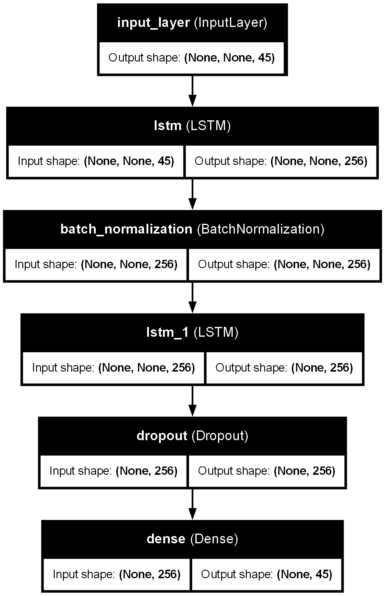
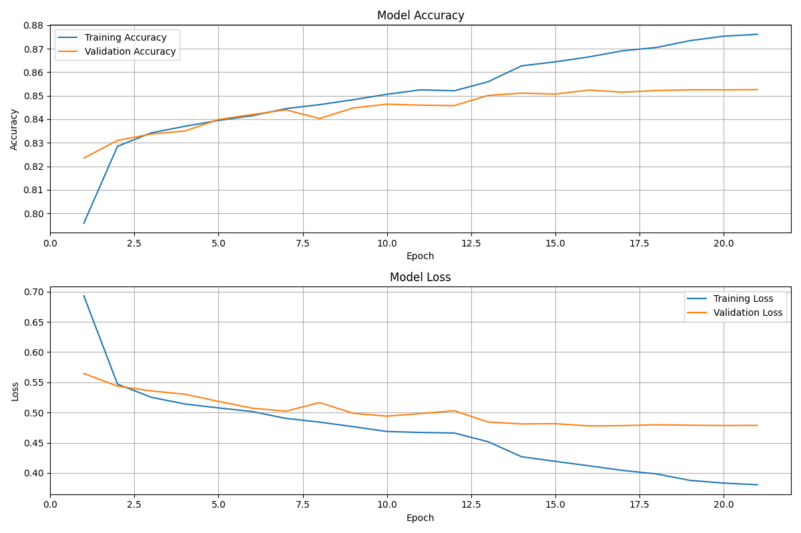
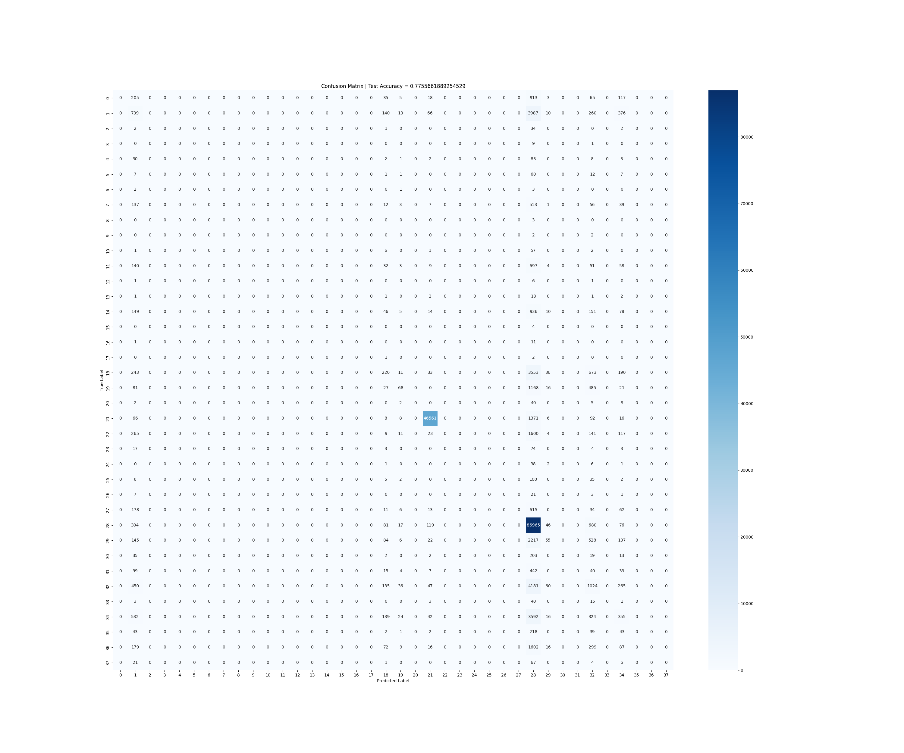
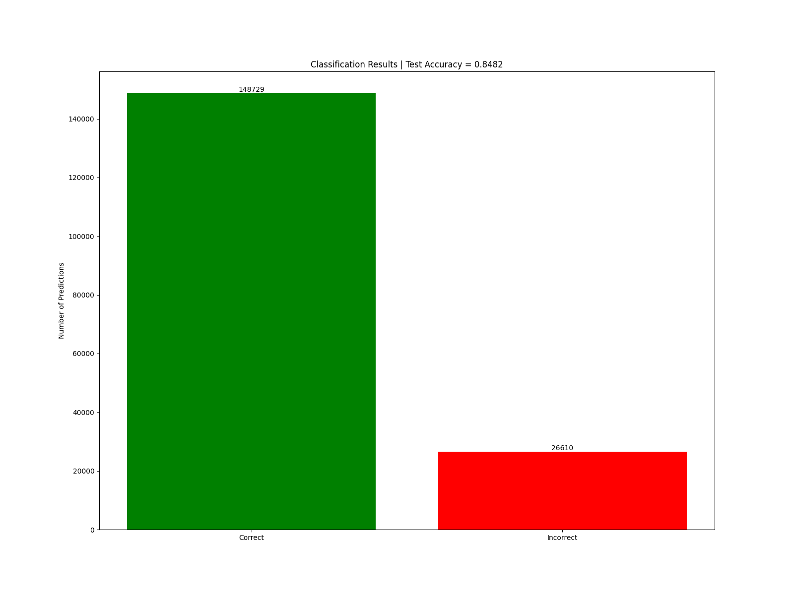

# MelodySynthesis: LSTM-Based Melody Generation

## 📌 Research Overview

This repository is part of an ongoing research project exploring deep learning approaches for melody synthesis. The study compares different architectures—including **LSTM, Transformer, a Transformer-LSTM hybrid, and a GAN-based Transformer-LSTM hybrid model**—to determine which performs best in generating musically coherent melodies.  

This branch (`lstm`) focuses specifically on **LSTM-based melody generation**, investigating how recurrent neural networks model temporal dependencies in musical sequences.  

## 📂 Repository Structure

```
MelodySynthesis/
│── melodies/               # Datasets used for training & evaluation
│── processed_data/         # Preprocessed data formatted for model input
│── model/                  # Trained models & related artifacts
│── plots/                  # Training analysis & model evaluation plots
│── src/
│   │── train.py            # LSTM model training script
│   │── melody_generator.py # Script to generate melodies using trained model
│   │── evaluate.py         # Performance evaluation metrics & visualization
│   │── utils.py            # Data preprocessing & helper functions
│── requirements.txt        # Dependencies
│── README.md               # Project documentation (this file)
│── LICENSE                 # License information
```

## 🎶 Model Architecture

The **LSTM model** is designed to generate sequences of musical notes based on training data. The architecture follows a sequential structure:  

- **Input Layer**: Sequences of musical notes encoded as vectors.  
- **LSTM Layer 1**: 256 units, returns sequences for further processing.  
- **Batch Normalization**: Normalizes activations to stabilize training.  
- **LSTM Layer 2**: 256 units, outputs a fixed-length representation.  
- **Dropout Layer**: Applied (rate=0.5) to prevent overfitting.  
- **Dense Output Layer**: Predicts the next note in the sequence.  

🔹 **Total Trainable Parameters**: 846,637  

Model visualization:  
  

## 📊 Training Details

**Training Parameters**:
- Optimizer: **Adam** (`lr=0.001`, adaptive learning rate)
- Loss Function: **Categorical Cross-Entropy**
- Batch Size: **64**
- Epochs: **50** (with **early stopping** to prevent overfitting)

Training stopped at **epoch 21**, achieving:
- **Training Accuracy**: **87.61%**
- **Validation Accuracy**: **85.26%**
- **Test Accuracy**: **85.36%**

**Training Progress** (loss & accuracy over epochs):  
  

## 📈 Model Performance & Evaluation  

The trained LSTM model was evaluated using standard classification metrics:  

✔️ **Confusion Matrix**:  
  

✔️ **Classification Counts**:  
  

### Key Observations:
- The LSTM successfully captures musical structure but exhibits slight overfitting.
- Some note sequences are more challenging to predict, as seen in the confusion matrix.
- The model maintains consistency across train, validation, and test sets.

## 🛠️ How to Use

### 1️⃣ Setup Environment  
Ensure dependencies are installed:  
```bash
pip install -r requirements.txt
```

### 2️⃣ Train the Model  
If you wish to retrain the model, run:  
```bash
python train.py
```

### 3️⃣ Generate Melodies  
Run the melody generation script:  
```bash
python melody_generator.py
```
Generated melodies will be saved in the `generated_melodies/` folder.

### 4️⃣ Evaluate the Model  
Analyze the model's performance using:  
```bash
python evaluate.py
```

## 💪 Research Significance  

This study contributes to **AI-driven music generation** by comparing deep learning architectures for melody synthesis. Our findings will:  
- Identify **which model best captures musical structure**.
- Explore how **recurrent networks** compare with **attention-based models** in sequence generation.
- Provide insights into **hybrid architectures (Transformer-LSTM, GAN-based models)** for music synthesis.

Each model is implemented in a separate branch:  
- **LSTM Model** (`lstm` branch) ⬅️ *(current branch)*  
- **Transformer Model** (`transformer` branch)  
- **Hybrid Transformer-LSTM** (`hybrid-transformer-lstm` branch)  
- **GAN-Based Model** (`gan-transformer-lstm` branch)  

By analyzing these models, we aim to determine the most **effective approach for AI-generated melodies**.  

## 🚀 Future Work

- 🔹 Implementing **Transformer & hybrid models** (comparison across architectures)
- 🔹 Exploring **music-theory-guided generation** (ensuring harmony & rhythm)
- 🔹 Enhancing **real-time generation capabilities**

## 🤝 Contributors

- **Soudeep Ghoshal** ([@SoudeepGhoshal](https://github.com/SoudeepGhoshal))   

## 🐝 License  

This project is licensed under the **MIT License**. See [LICENSE](LICENSE.txt) for details.  

---  
📌 **Note**: This is a research-oriented repository, and findings will be documented in an upcoming paper. If you use this work, please cite appropriately.